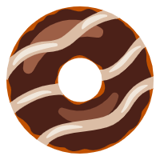

# 居中


## 水平居中


### 文本的水平居中

`text-align:center`


```css
        .box{
            width: 200px;
            height: 100px;
            border:2px dotted gray;
            
            text-align: center;
        }
```


### 元素块的水平居中


#### 块元素

margin


在不设置定位的情况下使用`margin:0 auto;`

需要先设置父元素的宽度，然后设置auto的元素才能够自适应居中


通过定位

```css
.box2{
    width: 200px;
    height: 200px;
    background: #6bb0c7;
}
.in{
    width: 50px;
    height: 50px;
    background: #e090b0;
    position:relative;
    top: 0;
    left:50%;
    /*平移，这里平移是根据自身的宽度平移，平移50%后到达中部*/
    transform:translateX(-50%);
}
```


* 通过设置定位，relative根据父元素的位置进行定位，然后再根据左右平移的方式实现居中，
* 使用同样的思路也能够实现垂直居中，


#### 行内块元素

行内块元素和行内元素实现水平居中只需要`text-align:center;`

行内块元素：使用了`display:inline-block`的元素，还有img元素

```css
        .box3{
            width: 500px;
            height: 300px;
            background: bisque;
            text-align: center;
        }
```

```html
<div class="box3">
    
</div>
```


##  垂直居中

###  文本

对于单行文本，只需要定义`line-height`和父元素的`height`相等即可实现垂直居中


**多行文本或者行内块元素**

使用`display: table-cell;` 和`vertical-align: middle;`

```css
        .box4{
            width: 300px;
            height: 300px;
            display: table-cell;
            vertical-align: middle;
            border:3px double palevioletred;
        }
```

```html
<div class="box4">
    <span>
        现在是下午
        <br>
        今天是3号
        <br>
        今天是周四
    </span>
</div>
```


#### 块元素

采用定位+平移的方式或者使用子绝父相

定位+平移的方式

```css
.box5{
    width: 300px;
    height: 300px;
    background: #6c6767;
}
.in2{
    width: 50px;
    height: 50px;
    background: #47e4d2;
    position: relative;
    top: 50%;
    left: 0;
    transform: translateY(-50%);
}
```

```htm
<div class="box5">
    <div class="in2"></div>
</div>
```


* 使用子绝父相的方式和也需要使用到平移的方式与上面的例子大同小异，故此不多加说明


实现元素水平+垂直居中将上面的稍加结合即可


```css
.in3{
    width: 50px;
    height: 50px;
    background: #2bc1fa;
    position: relative;
    top: 50%;
    left: 50%;
    transform: translate(-50%);
}
```


####  使用 flex 布局实现水平垂直居中


```css
        .box7{
            width: 400px;
            height: 400px;
            background: #47e4d2;
            display: flex;
            justify-content: center;
            align-items: center;
        }
        .in4{
            width: 50px;
            height: 50px;
            background: #000;
        }
```

